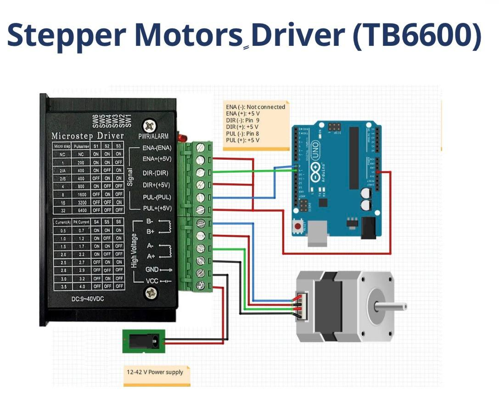
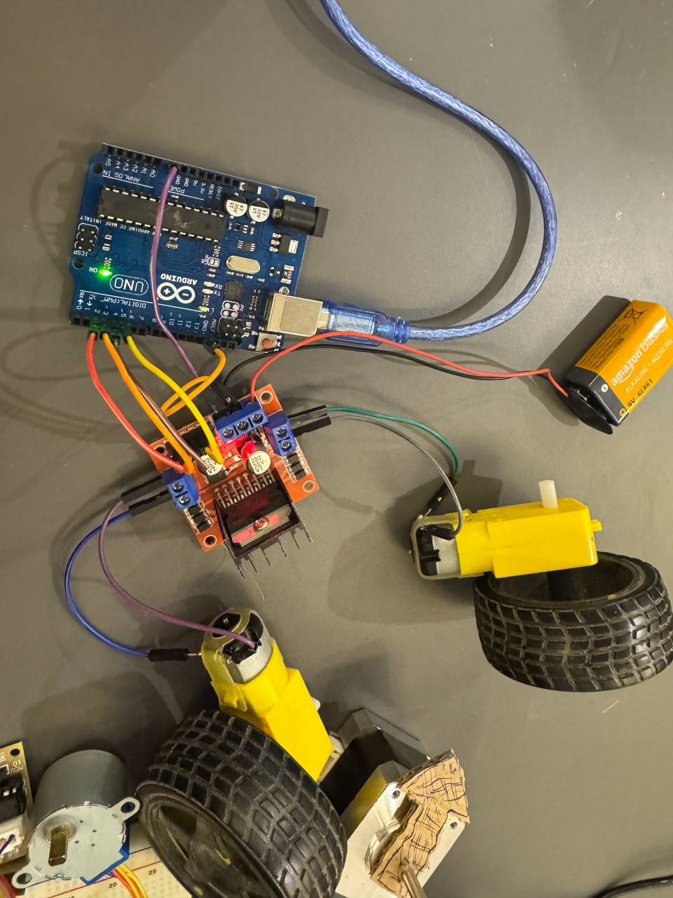

# Arduino-Motor-Control-Projects

# ⚙️ Arduino Motor Control Projects

A professional collection of Arduino-based motor control implementations demonstrating different motor technologies commonly used in robotics, automation, and embedded systems.

This repository presents practical hardware implementations using three different motor types and their corresponding drivers, including wiring, programming, and real-world testing.

---

# 📖 Project Overview

Motor control is one of the fundamental topics in embedded systems and robotics. This repository demonstrates how to interface Arduino Uno with multiple motor drivers to control different types of motors.

The projects cover DC motor control, high-power stepper motor control, and precision stepper motor control using dedicated driver modules.

---

# 🚀 Included Projects

| Project | Driver | Motor Type |
|----------|---------|------------|
| Stepper Motor Control | TB6600 | Bipolar Stepper Motor |
| DC Motor Control | L298N | DC Gear Motor |
| 28BYJ-48 Stepper Motor | ULN2003 | Unipolar Stepper Motor |

---

# 📂 Repository Structure
Arduino-Motor-Control-Projects/
│
├── StepperMotor/
│   └── StepperMotor/
│       ├── SMTB6600.jpg
│       ├── StepperMotor.mp4
│       ├── StepperMotor.result.jpg
│       └── connection-of-sm - Copy.jpg
│
├── DC-Motor/
│   └── DC.motor/
│       ├── DC Mr.jpg
│       ├── DC motor.jpg
│       ├── DC.MOTOR.MOV
│       └── DCMOTOR.jpg
│
├── 28BYJ-48 5V Stepper Motor (Unipolar)/
│   └── 28BYJ-48 5V Stepper Motor (Unipolar)/
│       ├── 28BYJ-48 5V SM(Unipolar).MOV
│       ├── 28BYJ-48 5V Stepper Motor (Unipolar).MOV
│       ├── SM-uni.jpg
│       └── SM-unipolar.jpg
│
└── README.md

---

# 🛠 Hardware Components

- Arduino Uno
- TB6600 Stepper Driver
- Bipolar Stepper Motor
- ULN2003 Driver Board
- 28BYJ-48 Stepper Motor
- L298N Motor Driver
- DC Gear Motor
- Wheel
- Jumper Wires
- USB Cable
- External Power Supply
- Soldering Tools

---

# 💻 Software

- Arduino IDE
- Arduino C++
- Serial Monitor

---

# ⚙️ Project 1 — Stepper Motor (TB6600)

## Overview

This project demonstrates precise position and speed control of a bipolar stepper motor using the TB6600 microstepping driver.

The Arduino generates STEP and DIRECTION signals while the TB6600 supplies sufficient current to drive the motor smoothly.

### Features

- Clockwise rotation
- Counter-clockwise rotation
- Adjustable speed
- High torque control
- Microstepping support
- Accurate positioning

### Hardware

- Arduino Uno
- TB6600 Driver
- Bipolar Stepper Motor
- External Power Supply

### Hardware Setup

### Wiring Reference

### Demonstration

🎥 [StepperMotor.mp4](StepperMotor/StepperMotor/StepperMotor.mp4)

---

# ⚙️ Project 2 — DC Motor (L298N)

## Overview

This project demonstrates controlling a DC geared motor using an Arduino Uno and the L298N H-Bridge motor driver.

Before assembling the system, the motor wires were soldered securely to ensure reliable electrical connections. After soldering, the wheel was mounted onto the motor shaft and the motor was successfully tested.

### Features

- Forward rotation
- Reverse rotation
- PWM speed control
- Motor stop
- Direction control

### Hardware

- Arduino Uno
- L298N Driver
- DC Gear Motor
- Wheel
- External Power Supply

### Hardware Setup

### Demonstration

🎥 [DC.MOTOR.MOV](DC-Motor/DC.motor/DC.MOTOR.MOV)

---

# ⚙️ Project 3 — 28BYJ-48 Stepper Motor (ULN2003)

## Overview

This project demonstrates controlling the 28BYJ-48 unipolar stepper motor using the ULN2003 driver board.

The ULN2003 sequentially energizes the motor coils, enabling precise low-speed positioning for embedded applications.

### Features

- Clockwise rotation
- Counter-clockwise rotation
- Precise positioning
- Smooth operation
- Simple Arduino interface

### Hardware

- Arduino Uno
- ULN2003 Driver

  - 28BYJ-48 Stepper Motor

### Hardware Setup

### Demonstration

🎥 [28BYJ-48 5V Stepper Motor (Unipolar).MOV](28BYJ-48%205V%20Stepper%20Motor%20(Unipolar)/28BYJ-48%205V%20Stepper%20Motor%20(Unipolar)/28BYJ-48%205V%20Stepper%20Motor%20(Unipolar).MOV)

---

# 🧠 Skills Demonstrated

- Embedded Systems
- Arduino Programming
- Motor Driver Interfacing
- PWM Control
- Stepper Motor Control
- DC Motor Control
- Hardware Assembly
- Electronics Prototyping
- Circuit Wiring
- Practical Soldering

---

# 🚀 Applications

- Mobile Robots
- Robotic Arms
- CNC Machines
- Conveyor Systems
- Smart Automation
- Pan-Tilt Systems
- Mechatronics Projects
- Educational Embedded Systems
- Industrial Motion Control

---

# 📸 Project Gallery

Each project folder contains:

- Arduino source code
- Hardware setup photos
- Demonstration video
- Documentation

---

# 🎥 Demonstration Videos

The repository includes demonstration videos showing the practical implementation of each project.

- StepperMotor/StepperMotor/StepperMotor.mp4
- DC-Motor/DC.motor/DC.MOTOR.MOV
- 28BYJ-48 5V Stepper Motor (Unipolar)/28BYJ-48 5V Stepper Motor (Unipolar)/28BYJ-48 5V Stepper Motor (Unipolar).MOV

---

# 📚 Learning Outcomes

Through these projects, I gained practical experience in:

- Controlling different motor technologies
- Selecting suitable motor drivers
- Hardware wiring and assembly
- Arduino programming
- Motion control fundamentals
- Driver interfacing
- Embedded systems development

---

# 🔮 Future Improvements

- Encoder feedback integration
- Closed-loop motor control
- Bluetooth control
- Wi-Fi control using ESP32
- Mobile application interface
- ROS integration
- PID motor control
- Autonomous robotic applications

---

# 📄 License

This repository is intended for educational purposes and portfolio demonstration.

---

# 👩‍💻 Author

Manar

Computer Engineering Student

Embedded Systems • Robotics • AI • IoT
